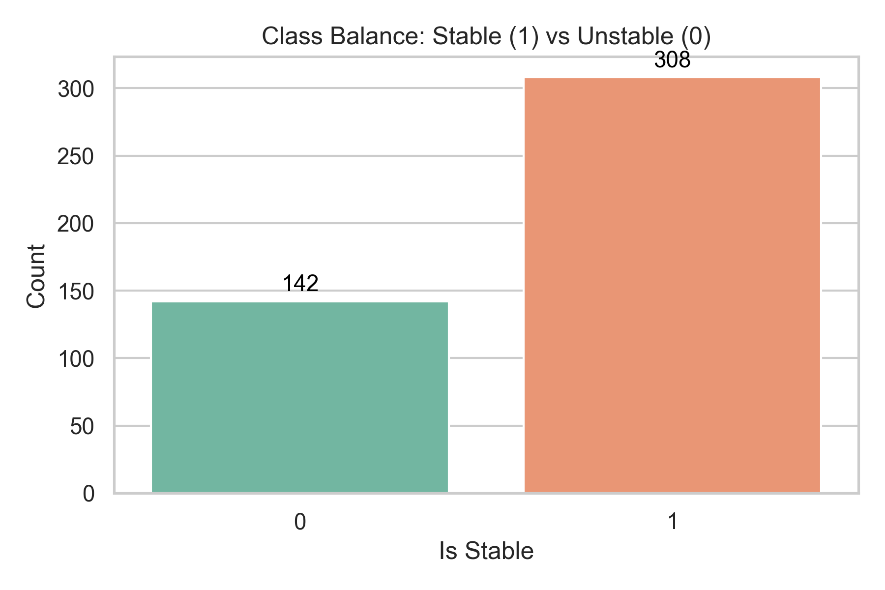
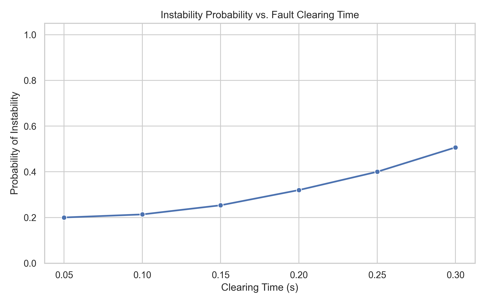
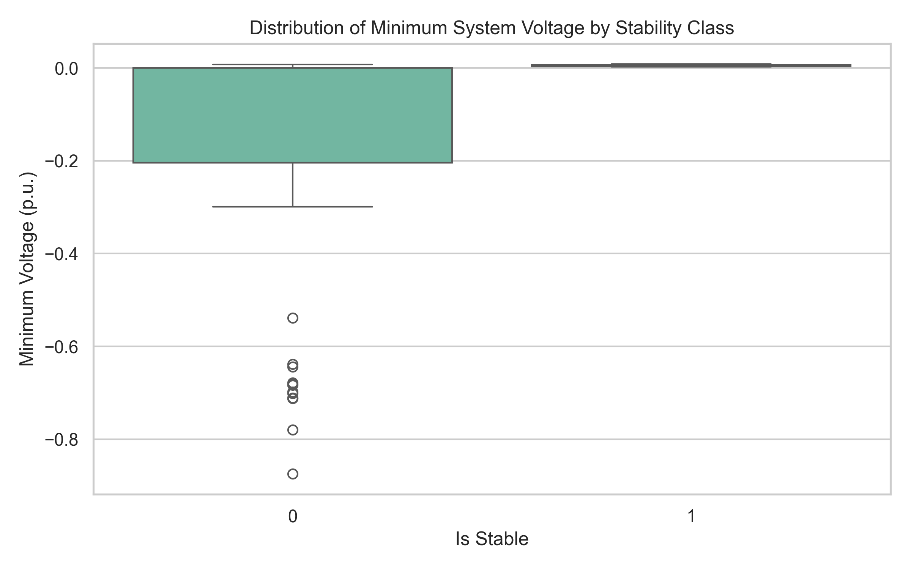

<div align="center">
  
</div>

# ⚡ Grid Stability Prediction using Machine Learning

[](https://www.python.org/)
[](https://docs.andes.app/)
[](https://opensource.org/licenses/MIT)

> **Electrical Engineering Minor Project (7th Semester)**  
> **National Institute of Technology (NIT), Raipur**

This repository contains an end-to-end simulation, dataset generation, and machine learning pipeline to predict power grid transient stability following severe disturbances. By combining traditional Time-Domain Simulation (TDS) with state-of-the-art Machine Learning, this project drastically reduces Transient Stability Assessment (TSA) times while demonstrating the ability of ML models to generalize to unseen topological operating conditions.

---

## 👥 Team Members
- **Sanskar Gupta** (Roll No: 23117091)
- **Daksh Tripathi** (Roll No: 23117036)
- **Karandeep Taram** (Roll No: 23117052)
- **Veena Gupta** (Roll No: 23117112)

---

## 📖 The Problem
When a major disturbance occurs in a power grid (e.g., short-circuit faults or transmission line trips), generators begin to swing against each other. If they swing too far apart, the system loses synchronism, potentially leading to cascading blackouts.

Traditionally, grid operators rely on solving complex, non-linear differential equations (Time-Domain Simulation) to determine stability—a highly accurate but **computationally expensive** process. 

**Our Solution:** We train a Machine Learning model that evaluates immediate post-fault electrical parameters to **instantly predict** whether the system will survive or collapse.

---

## 🏗️ Project Architecture & Pipeline

1. **Test System:** IEEE 39-Bus New England System (The academic benchmark for transient stability research).
2. **Simulation Engine:** [ANDES](https://docs.andes.app/) (Open-source, Python-native power system simulator).
3. **Data Generation Pipeline:** Config-driven multi-processing automation that applies faults, load scaling, and N-1 contingencies.
4. **Machine Learning:** Scikit-Learn + XGBoost.

---

## 📊 Exploratory Data Analysis (EDA)

We programmatically generated a dataset of **450 unique scenarios** using parallel processing. 

### Class Balance & Dataset Composition
The generated dataset achieves a highly realistic natural imbalance of roughly **2:1 (Stable:Unstable)**, providing a mathematically sound foundation for training ML models without synthetic upsampling.



### Physics Validation
Our simulations adhere strictly to power systems theory:
1. **Fault Clearing Time:** Faults cleared under 0.1s are almost exclusively stable, whereas longer faults (0.3s) rapidly destabilize the grid.
2. **Feature Correlation:** Unstable scenarios strongly correlate with deeper drops in the system's minimum voltage (`v_min_system`) during the transient window.

| Instability vs. Clearing Time | Feature Distribution (Voltage Sag) |
|:---:|:---:|
|  |  |

---

## ⚙️ How Stability is Labeled

To generate our ground-truth labels for ML training, we calculate the **Center of Inertia (COI)**. The COI acts as the "average" angle of the entire grid. A scenario is mathematically labeled as **Unstable (0)** if:
1. ANDES detects severe instability and terminates the numerical solver early.
2. The maximum relative rotor angle deviation of any individual generator from the COI exceeds **180 degrees** during the transient window.

Otherwise, the scenario is **Stable (1)**.

---

## 🚀 Setup & Execution Guide

### 1. Environment Setup
Clone the repository and install the required dependencies:
```bash
git clone https://github.com/TheFakeCreator/EE-Minor-Project.git
cd EE-Minor-Project

# Create and activate a virtual environment (Recommended)
python -m venv venv
# Windows: venv\Scripts\activate | Mac/Linux: source venv/bin/activate

# Install dependencies
pip install -r requirements.txt
pip install seaborn python-pptx  # Required for EDA and reports
```

### 2. Generating the Dataset
The data generation pipeline utilizes Python's `ProcessPoolExecutor` to run hundreds of ANDES simulations in parallel across multiple CPU cores.

```bash
# Set PYTHONPATH so the `src` module is discovered
# On Windows (PowerShell):
$env:PYTHONPATH="."
python -m src.simulation.generate_dataset --workers 6

# On Linux/Mac:
PYTHONPATH="." python -m src.simulation.generate_dataset --workers 6
```
*(Depending on your CPU architecture, generating the 450 scenarios takes ~3-5 minutes).*

### 3. Running the EDA & Reporting
To regenerate the statistical plots shown above and build the PowerPoint presentation automatically:
```bash
# Generate EDA Plots (saves to reports/figures/)
python src/eda/generate_plots.py

# Generate PPT Presentation (saves to reports/mid-sem-ppt/)
python src/reports/generate_ppt.py
```

---

## 🗺️ Roadmap & Milestones

- [x] **Phase 1:** Set up ANDES simulation harness and parallel data generation pipeline.
- [x] **Phase 2:** Exploratory Data Analysis (EDA) and Physics Validation.
- [ ] **Phase 3:** Train Baseline ML models (XGBoost, Random Forest) & execute generalization experiments.
- [ ] **Phase 4:** Critical Clearing Time (CCT) Regression mapping.
- [ ] **Phase 5:** Implement SHAP explainability.
- [ ] **Phase 6:** Develop an interactive Streamlit Web Application for real-time predictions.
